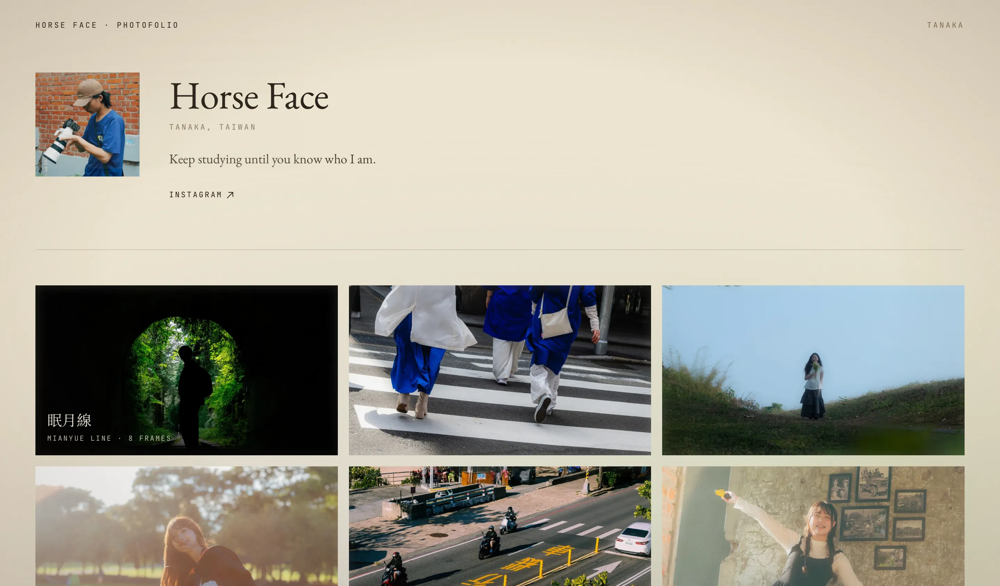

# Photofolio

馬臉 (Horse Face) 的個人攝影作品集。靜態網站：Next.js 15 (App Router, SSG) + Tailwind v4 + 自製 greedy masonry + Swiper lightbox + sharp 轉檔 + jsDelivr 當圖片 CDN。所有路由都是 build-time 靜態產生，沒有 server runtime。

| 首頁 | 相簿內頁 |
| :---: | :---: |
|  |  |

## 加一本新相簿

最常做的事，照這五步走：

1. 把新的 JPG 原圖丟進 `content/projects/<中文資料夾名>/`（例如 `content/projects/沖繩/`）。
2. 在同一個資料夾建一個 `index.mdx`，frontmatter 至少要有 `title`、`date`、`areas`，body 寫一句相簿介紹：
   ```mdx
   ---
   cover: "./0.jpg"
   date: "2026-08-15"
   title: "沖繩"
   areas:
     - Okinawa - Naha
   ---

   關於夏天的沖繩。
   ```
   `date` 會拿去做相簿排序（新的在前）；`title`、`areas`、body 全部會顯示在相簿頁。
3. 編輯 `scripts/build-images.mjs`，在檔案頂端的 `ALBUMS` 陣列裡新增一筆：
   ```js
   { folder: "沖繩", slug: "okinawa", title: "沖繩", titleEn: "Okinawa" },
   ```
   `folder` 對應 `content/projects/` 下的中文資料夾名；`slug` 是網址用的英文 slug；`title` 是 fallback（MDX 沒有 `title` frontmatter 時才用）。
4. 跑 `npm run prepare-images`。腳本會把原圖轉成 WebP（1200px 顯示版 + 600px 縮圖），寫到 `public/albums/<slug>/`，把 MDX 內容 merge 進 `content/albums.json`，並依 `date` 重新排序。Idempotent，重跑沒副作用。
5. Commit 兩個目錄／檔案：`public/albums/<slug>/` 和 `content/albums.json`。jsDelivr 是從 GitHub repo 直接抓檔，所以這些一定要進 git。
6. `npm run dev` 本地預覽 → `npm run build` 確認 SSG 沒壞。

## 本地 vs 生產的圖片 URL

- 本地開發：`NEXT_PUBLIC_CDN_BASE` 不設定，圖片直接從 `/albums/...`（也就是 `public/albums/`）讀。
- 生產環境：設定 `NEXT_PUBLIC_CDN_BASE` 環境變數，所有圖片 URL 會自動前綴成 jsDelivr CDN 路徑。

範例值見 `.env.example`：
```
NEXT_PUBLIC_CDN_BASE=https://cdn.jsdelivr.net/gh/<your-github>/Photofolio@main/public
```

URL 組裝邏輯在 `src/lib/cdn.ts`。

## 部署

目前 `.github/workflows/deploy.yml` 會在 `main` 分支 push 時自動部署到 Netlify，部署來源是 `next build` 產生的 `out/` 靜態檔案。

請先在 GitHub repository secrets 設定：

- `NETLIFY_AUTH_TOKEN`
- `NETLIFY_SITE_ID`

另外記得在 Netlify（或對應部署環境）設定 `NEXT_PUBLIC_CDN_BASE`。

## 哪個檔案改什麼

- `src/app/page.tsx` — 首頁（bio + 相簿列表）。
- `src/app/album/[slug]/page.tsx` — 單一相簿頁，masonry 排版 + 點圖開 lightbox。
- `src/components/Masonry.tsx` — 自製 greedy column-balanced masonry（把下一張塞進目前最矮那一欄，底邊比較不會差太多）。
- `src/components/Lightbox.tsx` — Swiper 全螢幕檢視。桌機顯示左右箭頭與右上 X，手機隱藏箭頭、用手勢滑動切換。
- `src/components/*` — 其他共用 UI 元件。
- `src/lib/albums.ts` — 讀 `content/albums.json` 的 helper。
- `src/lib/cdn.ts` — 把相對路徑（`/albums/...`）轉成 CDN 完整 URL 的小工具。

## 圖片規格

- 顯示版：1200px 寬，WebP，quality 88。
- 縮圖：600px 寬，WebP，quality 80，檔名 `*.thumb.webp`。
- EXIF 處理：先依 orientation 自動旋轉，再 strip 掉所有 metadata。
- 原圖（`content/projects/` 底下的 JPG）**不會** deploy，只是 source of truth；只有 `public/albums/` 底下的 WebP 會被 jsDelivr 服務。

## 常用指令

```
npm run dev              # 本地開發
npm run prepare-images   # 重新轉檔 + 產 manifest
npm run build            # SSG build
npm run start            # serve build 結果
```
